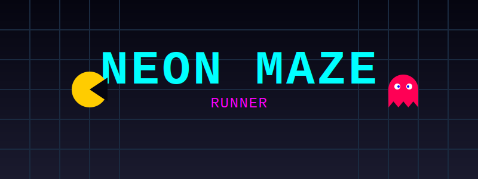

# Neon Maze


[](https://ai.studio/apps/drive/1vCMNUg6BbhXntZn1VAftSxvkYgvo-NWk?fullscreenApplet=true)

**Neon Maze** is a retro-futuristic arcade maze runner built with **React** and **TypeScript**. 
Navigate glowing labyrinths, outmaneuver spectral pursuers, and chase high scores in this high-performance web experience.

## Description
Neon Maze brings the classic "eat the dots" arcade gameplay to the modern browser with a sleek, neon-drenched aesthetic. Built from scratch without heavy game engines, it demonstrates how to build performant games using the standard DOM and Canvas APIs.

The game features a custom physics and state engine completely decoupled from the React view layer, ensuring smooth gameplay even on lower-end devices.

## Features
*   **Classic Gameplay Loop:** Collect all pellets to win, avoid ghosts, and use power pellets to turn the tables.
*   **High-Performance Rendering:** Uses the HTML5 Canvas API for smooth 60fps animations.
*   **Procedural Audio:** Sound effects are generated in real-time using the **Web Audio API** (no external MP3/WAV assets required).
*   **Reactive UI:** Seamlessly blends Canvas rendering with React for HUD, menus, and overlays.
*   **Mobile Support:** Includes a custom Virtual Joystick component for touch devices.
*   **Clean Architecture:** Strict separation between the `GameEngine` (logic/physics) and the React View layer.

## Installation
To run this project locally, you need **Node.js** installed on your machine.

1.  **Clone the repository:**
    ```bash
    git clone https://github.com/pfelipm/neon-maze.git
    cd neon-maze
    ```
2.  **Install dependencies:**
    ```bash
    npm install
    ```
3.  **Run the application:**
    ```bash
    npm run dev
    ```
4.  **Play:**
    Open your browser and navigate to `http://localhost:5173`.

## Controls
*   **Desktop:**
    *   `Arrow Keys` or `WASD` to move.
    *   `P` to Pause/Resume.
    *   `R` to Restart (when Game Over).
*   **Mobile:**
    *   Use the on-screen **Virtual Joystick** to steer.

## Technical Details

This project serves as a showcase of "Game Development with React" patterns.

*   **Frontend Framework:** [React 19](https://react.dev/) with [TypeScript](https://www.typescriptlang.org/).
*   **Build Tool:** [Vite](https://vitejs.dev/).
*   **Game Loop:** The core loop runs via `requestAnimationFrame` in `App.tsx`, triggering updates in the `GameEngine`.
*   **State Management:**
    *   **Game Logic:** A pure TypeScript `GameEngine` class handles collision detection, AI pathfinding, and score calculation.
    *   **UI State:** React Hooks (`useState`, `useRef`) manage high-level application states (Menu, Playing, Game Over).
*   **AI:** Ghosts use target-based pathfinding behavior (Chase, Scatter, Frightened modes).
*   **Styling:** Tailwind CSS for UI overlays.

### Architecture Highlight
Unlike many React games that rely heavily on `useEffect` for logic, Neon Maze isolates the game rules into a class-based model (`game/GameEngine.ts`). React is treated purely as a rendering layer (View), reading the engine's state frame-by-frame. This avoids "stale closure" traps common in React game development.

## Credits and Contributions
This project was created and is maintained by [Pablo Felip](https://github.com/pfelipm).

## License
This project is distributed under the MIT License. See the [LICENSE](./LICENSE) file for more details.
